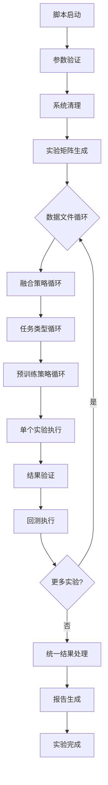

# MAS-CLS 项目结构详细说明

## 📁 项目目录结构

```
MAS_cls/
├── 📂 核心代码
│   ├── main1_maa.py                    # 主训练脚本 - 系统核心入口
│   ├── maa_encoder.py                  # MAA编码器实现 - 多资产对抗学习核心
│   ├── models1.py                      # 模型定义 - 主要网络架构
│   ├── time_series_maa.py              # 时间序列MAA模型 - MAA时序实现
│   ├── main_maa_encoder.py             # MAA编码器训练入口
│   ├── main_maa_encoder_training.py    # MAA编码器训练流程
│   ├── training_monitor.py             # 训练监控 - 实时监控训练状态
│   ├── training_visualizer.py          # 训练可视化 - 生成训练图表
│   └── real_maa_accuracy.py            # MAA准确度评估 - 性能验证
│
├── 📂 数据处理
│   ├── data/                           # 数据根目录
│   │   ├── raw/                        # 原始数据文件
│   │   ├── processed/                  # 预处理后的数据
│   │   │   ├── Copper_processed.csv    # 铜价数据
│   │   │   ├── Coke_processed.csv      # 焦炭数据
│   │   │   └── Gold_processed.csv      # 黄金数据
│   │   └── test_copper.csv             # 测试用铜价数据
│   └── data_processing/                # 数据处理模块
│       ├── __init__.py                 # 模块初始化
│       ├── data_loader.py              # 数据加载器 - 统一数据接口
│       └── dataset.py                  # 数据集类 - PyTorch数据集封装
│
├── 📂 模型定义
│   └── models/                         # 模型架构目录
│       ├── __init__.py                 # 模块初始化
│       ├── model_with_clsdisc.py       # 分类判别器模型
│       └── model_with_clsHead.py       # 分类头模型
│
├── 📂 批处理脚本
│   ├── run_all_experiments.bat         # Windows批处理脚本
│   ├── run_all_experiments.ps1         # PowerShell脚本
│   ├── run_all_experiments.sh          # Shell脚本 (Linux/macOS)
│   ├── batch_cleanup.py                # 批量清理脚本
│   ├── batch_unify_predictions.py      # 预测结果统一化工具
│   └── batch_generate_report.py        # 实验报告生成工具
│
├── 📂 回测验证
│   └── td/                             # 交易和回测目录
│       ├── mystrategy_paper.py         # 主要策略回测脚本
│       ├── mystrategy_paper2323.py     # 策略变体
│       └── backtest_results/           # 回测结果存储
│
├── 📂 输出结果
│   └── output/                         # 实验输出根目录
│       ├── Copper_processed/           # 铜价实验结果
│       │   ├── predictions.csv         # 预测结果
│       │   ├── *.pth                   # 模型权重文件
│       │   ├── training_logs/          # 训练日志
│       │   ├── training_plots/         # 训练图表
│       │   └── backtest_results/       # 回测结果
│       ├── Coke_processed/             # 焦炭实验结果
│       ├── Gold_processed/             # 黄金实验结果
│       ├── unified_predictions.csv     # 统一预测结果
│       └── experiment_report_*.json    # 实验报告
│
├── 📂 配置文件
│   ├── config.yaml                     # 主配置文件
│   ├── requirements.txt                # Python依赖列表
│   └── .vscode/                        # VS Code配置
│
└── 📂 文档
    ├── README.md                       # 项目主文档
    ├── README_EXP.md                   # 实验详细说明
    ├── PROJECT_STRUCTURE.md            # 本文件
    └── CODE_ARCHITECTURE_SUMMARY.md    # 代码架构总结
```

## 🔧 核心模块详解

### 1. 主训练脚本 (`main1_maa.py`)

**功能**: 系统的核心入口，集成了所有训练策略和模式

**主要特性**:
- 支持多种任务模式：回归、分类、投资
- 支持多种融合策略：gating、attention、concat
- 支持多种预训练策略：基准、监督、对抗、MAA
- 完整的命令行参数接口
- 自动化的训练流程管理

**关键参数**:
```python
--data_path              # 数据文件路径
--task_mode             # 任务模式 [regression/classification/investment]
--fusion                # 融合策略 [gating/attention/concat]
--maa_pretrain          # 启用MAA预训练
--pretrain_encoder      # 启用监督预训练
--adversarial_refinement # 启用对抗预训练
--pretrain_epochs       # 预训练轮数
--finetune_epochs       # 微调轮数
--output_dir            # 输出目录
```

### 2. MAA编码器 (`maa_encoder.py`)

**功能**: 实现多资产对抗（MAA）学习的核心编码器

**技术特点**:
- 多窗口时间序列处理
- 生成器-判别器对抗训练
- 跨资产知识迁移
- 自适应特征学习

**核心组件**:
```python
class MAAEncoder:
    - TimeSeriesGenerator     # 时间序列生成器
    - Discriminator          # 判别器网络
    - AdversarialLoss       # 对抗损失函数
    - KnowledgeDistillation # 知识蒸馏机制
```

### 3. 模型架构 (`models1.py`)

**功能**: 定义主要的神经网络架构

**模型组件**:
- **Encoder**: 特征编码器，将原始特征映射到隐藏空间
- **Predictor**: 预测器，用于回归任务
- **Classifier**: 分类器，用于分类和投资任务
- **FusionModule**: 融合模块，整合多种特征

**架构设计**:
```python
class TimeSeriesModel:
    def __init__(self):
        self.encoder = TransformerEncoder()
        self.fusion = FusionModule()
        self.predictor = MLPPredictor()
        self.classifier = MLPClassifier()
```

### 4. 训练监控 (`training_monitor.py`)

**功能**: 实时监控训练过程，记录和可视化训练指标

**监控内容**:
- 损失函数变化
- 准确率/性能指标
- 学习率调整
- 梯度范数
- 训练时间统计

**输出文件**:
- `training_log.json`: 详细训练记录
- `training_stats.png`: 训练统计图表
- `loss_curves.png`: 损失函数曲线

### 5. 数据处理模块 (`data_processing/`)

**功能**: 统一的数据加载和预处理接口

**主要类**:
```python
class TimeSeriesDataset:
    - 时间序列数据封装
    - 滑动窗口生成
    - 标准化和归一化
    - 训练/验证/测试划分

class DataLoader:
    - 批处理数据生成
    - 多进程数据加载
    - 内存优化管理
```

## 🚀 批处理脚本系统

### 跨平台支持

**Windows批处理** (`run_all_experiments.bat`):
- 原生Windows CMD支持
- 中文输出优化
- 错误处理和恢复机制

**PowerShell脚本** (`run_all_experiments.ps1`):
- 现代PowerShell语法
- 更好的错误处理
- 跨平台兼容性

**Shell脚本** (`run_all_experiments.sh`):
- Linux/macOS原生支持
- POSIX兼容
- 高性能并行处理

### 脚本功能对比

| 功能 | .bat | .ps1 | .sh |
|------|------|------|-----|
| 中文输出 | ✅ | ✅ | ✅ |
| 错误处理 | ✅ | ✅ | ✅ |
| 进度显示 | ✅ | ✅ | ✅ |
| 参数验证 | ✅ | ✅ | ✅ |
| 自动清理 | ✅ | ✅ | ✅ |
| 回测集成 | ✅ | ✅ | ✅ |
| 报告生成 | ✅ | ✅ | ✅ |

### 执行流程



## 📊 数据流架构

### 数据处理流程


### 特征结构

**输入特征** (共31列):
- 列1-3: 基础价格特征
- 列4: 目标价格 (回归任务)
- 列5-28: 技术指标特征
- 列29: 分类标签 (分类/投资任务)
- 列30-31: 辅助特征

**时间窗口处理**:
- 默认窗口大小: 10个时间步
- 支持多窗口MAA: [5, 10, 15]
- 滑动窗口预测

## 🔄 训练流程架构

### 预训练策略对比

| 策略 | 预训练阶段 | 微调阶段 | 特点 |
|------|-----------|----------|------|
| Baseline | ❌ | ✅ | 端到端训练 |
| Supervised | ✅ | ✅ | 编码器预训练 |
| Adversarial | ✅ | ✅ | 对抗鲁棒性 |
| MAA | ✅ | ✅ | 跨资产知识迁移 |

### 训练阶段详解

**1. 预训练阶段**:
```python
# MAA预训练示例
for epoch in range(pretrain_epochs):
    # 生成器训练
    generator_loss = train_generators()
    # 判别器训练  
    discriminator_loss = train_discriminators()
    # 知识蒸馏
    distillation_loss = knowledge_distillation()
```

**2. 微调阶段**:
```python
# 任务特定微调
for epoch in range(finetune_epochs):
    # 前向传播
    predictions = model(batch_data)
    # 任务损失计算
    task_loss = compute_task_loss(predictions, targets)
    # 反向传播
    optimizer.step()
```

## 🎯 输出结果架构

### 实验结果组织

```
output/{Asset}_processed/
├── 📄 模型文件
│   ├── encoder.pt                      # 编码器权重
│   ├── predictor.pt                    # 预测器权重
│   ├── classifier.pt                   # 分类器权重
│   └── maa_knowledge.pt                # MAA知识库
│
├── 📊 预测结果
│   ├── predictions.csv                 # 原始预测结果
│   ├── {asset}_results.csv            # 性能指标汇总
│   ├── real_vs_predicted_curve.png     # 预测对比曲线
│   └── real_vs_predicted_scatter.png   # 预测散点图
│
├── 📈 训练记录
│   ├── training_logs/                  # 训练日志目录
│   │   ├── {experiment}_training_log.json
│   │   └── plots/                      # 训练过程图表
│   └── training_plots/                 # 训练可视化
│       ├── loss_curves.png            # 损失曲线
│       ├── accuracy_curves.png        # 准确率曲线
│       └── training_summary.txt       # 训练总结
│
└── 🔍 回测结果
    └── backtest_results/               # 回测验证结果
        ├── regression/                # 回归任务回测
        ├── classi

fication/          # 分类任务回测
        └── investment/               # 投资任务回测
```

### 统一结果格式

**预测结果** (`predictions.csv`):
```csv
timestamp,actual,predicted,confidence,signal
2024-01-01,100.5,99.8,0.85,1
2024-01-02,101.2,100.9,0.82,1
...
```

**性能指标** (`{asset}_results.csv`):
```csv
metric,value,experiment_type
mse,0.0234,regression_gating_maa
accuracy,0.832,classification_attention_supervised
sharpe_ratio,1.67,investment_concat_adversarial
...
```

## 🔧 配置管理

### 主配置文件 (`config.yaml`)

```yaml
# 模型配置
model:
  hidden_dim: 128
  num_layers: 2
  dropout: 0.1
  activation: 'relu'

# 训练配置
training:
  batch_size: 64
  pretrain_epochs: 10
  finetune_epochs: 20
  lr_pretrain: 1e-4
  lr_finetune: 5e-5
  weight_decay: 1e-5
  gradient_clip: 1.0

# MAA配置
maa:
  window_sizes: [5, 10, 15]
  generator_names: ['gru', 'lstm', 'transformer']
  n_pairs: 3
  num_classes: 3
  adversarial_weight: 0.1
  distillation_weight: 0.5

# 数据配置
data:
  window_size: 10
  train_ratio: 0.7
  val_ratio: 0.15
  test_ratio: 0.15
  normalize: true
  
# 输出配置
output:
  save_model: true
  save_predictions: true
  save_plots: true
  plot_format: 'png'
  log_level: 'INFO'
```

### 依赖管理 (`requirements.txt`)

```text
# 核心依赖
torch>=1.9.0
numpy>=1.20.0
pandas>=1.3.0
scikit-learn>=1.0.0

# 可视化
matplotlib>=3.4.0
seaborn>=0.11.0
plotly>=5.0.0

# 配置管理
PyYAML>=5.4.0
argparse

# 性能优化
tqdm>=4.62.0
joblib>=1.1.0

# 回测相关
backtrader>=1.9.76
quantlib>=1.21
```

## 🚀 扩展性设计

### 模块化架构优势

1. **可插拔组件**: 各模块独立，易于替换和升级
2. **统一接口**: 标准化的API设计，便于集成
3. **配置驱动**: 通过配置文件控制行为，无需修改代码
4. **跨平台支持**: 多种脚本格式，适应不同环境

### 未来扩展方向

**新模型架构**:
- Transformer变体
- 图神经网络
- 强化学习策略

**新数据源**:
- 高频交易数据
- 新闻情感数据
- 宏观经济指标

**新评估指标**:
- 风险调整收益
- 尾部风险度量
- 流动性成本分析

**系统优化**:
- 分布式训练
- 模型压缩
- 在线学习能力

---

**维护建议**:
- 定期更新依赖版本
- 备份重要的实验结果
- 监控系统资源使用
- 记录实验配置和结果
